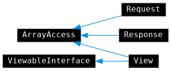

Helix::Site
===========

Route requests without overhead and respond as you like.

[](https://www.php.net)
[](https://packagist.org/packages/hfw/site)
[](LICENSE.txt)
[](https://scrutinizer-ci.com/g/hfw/site)
[](https://scrutinizer-ci.com/g/hfw/site)

[](https://hfw.github.io/site/inherits.html)

Documentation: https://hfw.github.io/site

```
composer require hfw/site
```

Web I/O
========

`index.php`
---------

```php
<?php

include 'vendor/autoload.php';

use Helix\Site;
use Helix\Site\View;

$site = new Site;

// "GET /"
$site->get('/', function() {
    return 'Hello World!';
});

// "GET /foo/123" (regex)
$site->get('#^/foo/(?<id>[0-9]+)$#', function(array $path) {
    return new View('view/foo.phtml', [
        'id' => (int)$path['id']
    ]);
});
```

`view/foo.phtml`
--------------
```php
<?php

use Helix\Site\View;

/**
 * @var View $this
 * @var int $id 
 */

echo $id;
```

Under the Hood
--------------

- The `Site` constructor takes care of general environment setup, including error handling and logging.
- If no routes matched, a `404` or `405` error is rendered.
- Each HTTP error code can have its own template. A generic template is used as a fallback.

Views
-----

`View` instances merely `include` their templates (`phtml` files).
Within the scope of those files, `$this` refers to the `View` instance itself.
Any data given to the view is converted to variables via `extract()` prior to and in the same scope as the template inclusion.
Data can also be accessed via `ArrayAccess`. 

By convention, templates should be stored in the `view` directory in the document root.

Any `ViewableInterface` can be returned from a controller to be rendered, as well as plain strings.

nginx config
------------

```
server {
    # ... server config ...
    location / {
        # ... fastcgi config ...
        fastcgi_param SCRIPT_FILENAME $document_root/index.php;
    }
}
```